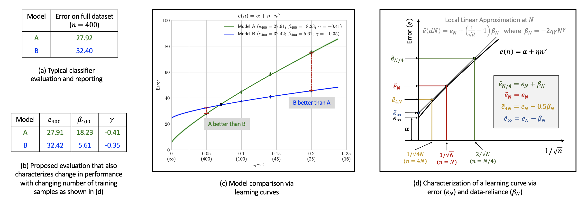
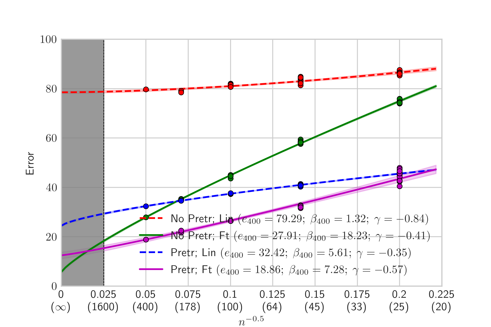

# Improving your learning curve for using "Learning Curves"
This standalone repository is provided as part of our work [Learning Curves for Analysis of Deep Networks](https://arxiv.org/abs/2010.11029?) and hopes to make it ridiculously simple to estimate and plot learning curves for your new classifier. 



# Installation
```
conda create -n lc python=3.9
conda activate lc
conda install -c conda-forge matplotlib ipdb -y
conda install -c anaconda numpy jupyter -y
pip install omegaconf
```

Also, please make sure that Tex is installed and added to `$PATH` for the latex in plots to render correctly. For instance, on Mac you may install [MacTex](http://www.tug.org/mactex/).

# Getting error measurements
To compute a learning curve, you must first train models on different partitions of your training set and compute val or test errors for each partition. To preseve the class distribution, we suggest partitioning the set of samples from each class into the required number of disjoint subsets. The same evaluation set is used irrespective of the training partition. Given a training set with N samples, we recommend partitioning your training set as follows:


| Training Set Size | Number of partitions |
|-------------------|----------------------|
| N                 | 1                    |
| N/2               | 2                    |
| N/4               | 4                    |
| N/8               | 8                    |
| N/16              | 16                   |


For each training set size, learning curve estimation requires computing the mean and variance of errors at each training set size and hence the need for training models on multiple partitions. Note that having exactly the above mentioned number of partitions is not strictly necessary. For instance, you may only have 10 instead of 16 partitions for training set size of N/16 due to prohibitive training cost but may still be able to obtain a reasonably accurate learning curve. You may also skip some train set sizes as long as you have at least 3 training set sizes at least 1 of which has more than 1 partitions. However, more training set sizes means lower variance in curve estimation. If in a rush, use N, N/2, and N/4. If in an extreme rush, you may even use one error measurement per partition. 

## Why this particular partitioning choice?
Training models on smaller training sets is typically cheaper but might require more measurements due to higher error variance. Our recommended partitioning strategy strikes a trade-off between getting good estimates of error variance while avoiding prohibitive training times.   

## What about estimating variance for the training set of size N?
We fit a function of the form `var(n) = v_0 + v_1 / n` to error variances obtained from all training set sizes with more than 1 partitions. The choice of the functional form is motivated by learning theory which suggests that error variance decreases linearly as the amount of training data increases but we add a `v_0` term to accomodate the possibility of non-zero variance even at infinite training data. This functional form of the error variance serves two purposes:

- Estimate variance for any training set size, including at N where we only have a single parition
- Reduce the variance in the estimates of error variance on small sample sizes (the number of partitions) 

# Input format
Format the error measurements for your classifier as follows (assuming 1000 training samples):
```
[
    {
        "num_train_samples": 1000,
        "test_errors": [list of errors]
    },
    {
        "num_train_samples": 500,
        "test_errors": [list of errors]
    },
    {
        "num_train_samples": 250,
        "test_errors": [list of errors]
    },
    {
        "num_train_samples": 125,
        "test_errors": [list of errors]
    },
]
```
As examples, [data/](data/) directory contains error measurements used in Fig.5(a) in our [paper](https://arxiv.org/abs/2010.11029?).

# Usage
We provide a simple example in `basic_usage.py` which is as follows:
```python
from lc.measurements import CurveMeasurements
from lc.curve import LearningCurveEstimator
from omegaconf import OmegaConf
import matplotlib
import matplotlib.pyplot as plt

# Load error measurements
curvems = CurveMeasurements()
curvems.load_from_json('data/no_pretr_ft.json')

# Load config
cfg = OmegaConf.load('lc/config.yaml')

# Estimate curve
curve_estimator = LearningCurveEstimator(cfg)
curve, objective = curve_estimator.estimate(curvems)

# Plot
curve_estimator.plot(curve,curvems,label='No Pretr; Ft')
plt.show()
```

To test the above code you may run 
```
python -m basic_usage
```

OR 

Use one of the following notebooks: 
- [notebooks/basic_usage.ipynb](notebooks/basic_usage.ipynb): the same as `basic_usage.py` but in an interactive notebook
- [notebooks/basic_lazy_usage.ipynb](notebooks/basic_lazy_usage.ipynb) for constructing a learning curve from only 1 error measurement each at full, half, and quarter dataset size. Esentially, you will have a learning curve with just 3 error measurements!


# Dig deeper with interactive notebooks
To help ML practitioner better understand learning curve estimation, we provide the following ipython notebooks:

- [notebooks/measurements.ipynb](notebooks/measurements.ipynb): Shows how error measurements can be read and displayed using `CurveMeasurements`.
- [notebooks/variance.ipynb](notebooks/variance.ipynb): Shows how error variances are computed using `ErrorMeanVarianceEstimator` (used inside `LearningCurveEstimator`) and how the smoothed variance compares to sample error variance.
- [notebooks/curve.ipynb](notebooks/curve.ipynb): Shows how to modify the config interactively, use `LearningCurveEstimator` to compute a learning curve and get a summary of curve parameters, and add multiple curves to the same plot for easy comparison.

# A note on extrapolating performance
Learning curves are a powerful tool for extrapolating performance of your model and learning algorithm to much larger dataset sizes than your current dataset. Such extrapolations can help guide practical decisions such as whether to invest in collecting more data or in designing a better architecture or learning algorithm. We have found our learning curves to predict performance quite well upto 4x the amount of training data available in the full training set. However, we suggest users be careful when trying to extrapolate performance beyond 4x training data as the learning curve may become less accurate as `n` tends to `inf`. To signal caution, by default, we shade the region where `n > 4N`. Here, `N` is the full dataset size or the largest dataset size whose error measurment is used for computing the learning curve. Shading may be turned off by setting `cfg.shade_gt_4N` to `False`. 



# Citation
We hope you will consider using learning curves to evaluate your classifier and to more thoroughly investigate the impact of various design decisions. If you find our work useful, please use the following BibTex to cite:
```
@article{Hoiem2020LearningCurve,
  title={Learning Curves for Analysis of Deep Networks},
  author={Derek Hoiem and Tanmay Gupta and Zhizhong Li and Michal Shlapentokh-Rothman},
  journal={ArXiv},
  year={2020},
  volume={abs/2010.11029}
}
```